# 🏗️ Architecture Diagram (Proposed)

## System Overview

---

## Component Interaction - Purchase Flow

```mermaid
sequenceDiagram
    autonumber
    actor Customer
    participant MVC as Frontend<br/>(MVC)
    participant API as Backend<br/>(Minimal API)
    participant Payment as Payment<br/>Service
    participant Sub as Subscription<br/>Service
    participant ARM as ARM<br/>Client
    participant Azure as Azure<br/>APIM

    Customer->>MVC: Select "Gold Tier"
    Customer->>MVC: Click "Purchase"
    
    MVC->>API: POST /api/purchase<br/>{productId: "gold", customer}
    
    API->>Payment: ValidatePayment()
    Payment-->>API: ✓ Payment OK (stubbed)
    
    API->>Sub: CreateSubscription(productId, customer)
    
    Sub->>ARM: CreateApimSubscription()<br/>{scope, productId}
    ARM->>Azure: PUT /subscriptions/{id}<br/>ARM API 2024-05-01
    Azure-->>ARM: Subscription Created
    
    ARM->>Azure: POST /listSecrets
    Azure-->>ARM: {primaryKey, secondaryKey}
    
    ARM-->>Sub: {subscriptionId, keys}
    Sub-->>API: {subscriptionId, keys, status}
    
    API-->>MVC: 200 OK<br/>{subscriptionId, primaryKey, secondaryKey}
    
    MVC-->>Customer: 🎉 Purchase Successful!<br/>Display Keys
```

---

## Component Interaction - Key Rotation Flow

---

## Component Interaction - Deactivation Flow

---

## Technology Stack Layers

---

## Deployment Architecture (Future State)

---

## Project Structure (File System)

---

**Note**: These diagrams represent the proposed architecture. They will be refined and included in the `docs/` folder once the structure is approved.
