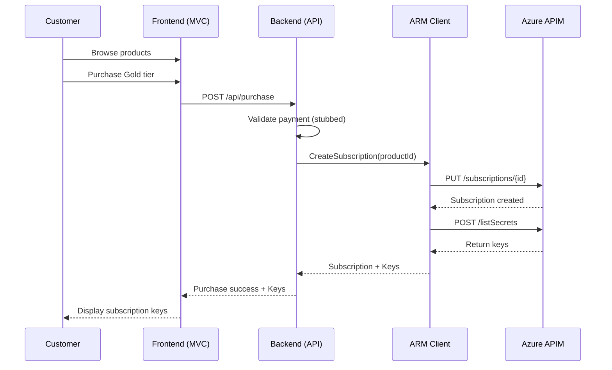

# 📋 Project Structure Proposal - Quick Summary

## 🎯 What We're Building

A complete **.NET 9** solution demonstrating external billing system integration with Azure APIM:

- **Frontend**: ASP.NET Core MVC app (customer portal)
- **Backend**: Minimal API (REST API for subscription management)
- **ARM Client**: Reusable library for APIM ARM operations
- **Tests**: xUnit test projects
- **CI/CD**: GitHub Actions workflows
- **Docs**: Architecture, flows, and API reference

---

## 📦 Solution Structure (5 Projects)

```
ApimBilling.sln
│
├── src/
│   ├── ApimBilling.Frontend/        # MVC Web App (.NET 9)
│   ├── ApimBilling.Backend/         # Minimal API (.NET 9)
│   ├── ApimBilling.ArmClient/       # ARM Client Library
│   └── ApimBilling.Shared/          # Shared Models/Constants
│
└── tests/
    ├── ApimBilling.Frontend.Tests/  # Frontend unit tests
    ├── ApimBilling.Backend.Tests/   # Backend unit tests
    └── ApimBilling.ArmClient.Tests/ # ARM client unit tests
```

---

## 🔄 Key Flows

### Purchase Flow


---

## 🛠️ Technology Stack

| Component | Technology |
|-----------|------------|
| **Frontend** | ASP.NET Core MVC 9, Razor, Bootstrap 5 |
| **Backend** | .NET 9 Minimal API, Swagger/OpenAPI |
| **ARM Client** | Azure.Identity, HttpClient |
| **Testing** | xUnit, Moq, FluentAssertions |
| **CI/CD** | GitHub Actions |
| **Documentation** | Markdown + Mermaid diagrams |

---

## 🔐 Environment Variables

```bash
# Azure APIM
APIM_NAME=my-apim-instance
APIM_RESOURCE_GROUP=my-rg
AZURE_SUBSCRIPTION_ID=xxx-xxx-xxx

# Authentication
AZURE_TENANT_ID=xxx-xxx-xxx
AZURE_CLIENT_ID=xxx-xxx-xxx
AZURE_CLIENT_SECRET=xxx-xxx-xxx

# Products
PRODUCT_BRONZE=bronze-tier
PRODUCT_SILVER=silver-tier
PRODUCT_GOLD=gold-tier
```

---

## 📋 REST API Endpoints

| Method | Endpoint | Description |
|--------|----------|-------------|
| `GET` | `/api/products` | List available products |
| `POST` | `/api/purchase` | Purchase product & create APIM subscription |
| `POST` | `/api/subscriptions/{id}/rotate` | Rotate subscription keys |
| `DELETE` | `/api/subscriptions/{id}` | Deactivate subscription |

---

## 🚀 Implementation Plan (After Approval)

1. ✅ **Proposal Created** ← You are here
2. ⏳ **Waiting for Approval**
3. 🔧 Create .NET solution & projects
4. 🔐 Implement ARM Client Library
5. 🔗 Implement Backend API
6. 🎨 Implement Frontend MVC
7. ✅ Add Tests
8. 🔄 Create GitHub Actions
9. 📝 Write Documentation

---

## ❓ Key Questions to Answer

1. **Database**: Do we need to persist purchase history?
2. **Authentication**: Should the frontend require user login?
3. **Deployment**: Azure Web Apps or Container Apps?
4. **Logging**: Application Insights or console logging?
5. **Error Handling**: Retry logic for ARM API failures?

---

## 📄 Full Details

See **[PROJECT_STRUCTURE_PROPOSAL.md](./PROJECT_STRUCTURE_PROPOSAL.md)** for:
- Complete directory structure
- Detailed component breakdown
- Testing strategy
- GitHub Actions workflow specs
- Documentation plan
- All clarifying questions

---

**Status**: ✋ **Awaiting approval before generating code**

Once approved, I will create the complete working solution via incremental PRs! 🚀
