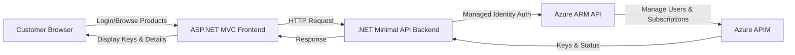

# APIM Billing Integration Demo

A complete .NET 9 reference implementation showing how to integrate an **external billing system** with **Azure API Management (APIM)** to provision, update, and deactivate API subscriptions based on customer payment actions.

This demo provides a clean, repeatable pattern for organizations implementing **API monetization**, **external billing workflows**, or **custom subscription lifecycle automation**.

---

## 🎯 What This Demo Shows

This sample demonstrates the full **browse → purchase → manage** subscription lifecycle:

1. **Customer logs in** with email and name (session-based demo authentication)
2. **Customer browses products** - Dynamically fetched from your APIM instance
3. **Customer purchases a product**:
   - Creates APIM user (or uses existing AAD user)
   - Creates active APIM subscription linked to the user
   - Receives subscription keys (hidden by default for security)
4. **Customer manages subscriptions**:
   - View "My Subscriptions" filtered by their email
   - Simulate payment actions: "User Stopped Paying" → Suspends, "User Resumed Paying" → Reactivates
   - "User Declined to Pay" → Permanently deletes subscription
   - Rotate API keys as needed
5. **Billing API interacts with ARM**:
   - Creates/updates APIM users (supports both custom and AAD users)
   - Manages subscription lifecycle via Azure Resource Manager REST API
   - Retrieves and rotates subscription keys

**Key Patterns**: 
- ARM REST APIs (api-version 2024-05-01) with Managed Identity authentication
- Dynamic product discovery - no hardcoded product lists
- User Secrets for local development secrets
- Session-based demo authentication (no real auth required)
- Proper AAD user support via APIM user lookup

---

## 🏗 Architecture



### Components

- **Frontend** (`ApimBilling.Web`): 
  - ASP.NET Core MVC with Bootstrap 5 and Bootstrap Icons
  - Session-based user tracking (demo mode - no real authentication)
  - Product catalog, subscription management, and customer action workflows
  - Secure key display (hidden by default, reveal on click)
  
- **Backend** (`ApimBilling.Api`): 
  - .NET 9 Minimal API with Swagger UI
  - Dynamic product discovery from APIM
  - APIM user management (supports AAD users via API lookup)
  - Subscription CRUD operations via ARM REST API
  - Managed Identity authentication
  
- **Infrastructure**: 
  - Bicep templates for App Services and Application Insights
  - Parameter-based configuration (no hardcoded values)
  - RBAC role assignments for Managed Identity

---

## 📦 Project Structure

```
apim-billing-integration-demo/
├── src/
│   ├── ApimBilling.Web/              # Frontend MVC app (ports 5012/7108)
│   ├── ApimBilling.Api/              # Backend Minimal API (ports 5000/5001)
│   └── ApimBilling.Contracts/        # Shared DTOs
├── infra/                             # Bicep infrastructure
│   ├── main.bicep                     # Main infrastructure template
│   ├── main.bicepparam                # Parameter file (placeholders for Git)
│   └── deploy.sh.example              # Deployment script template
└── README.md
```

---

## 🚀 Quick Start

### Prerequisites

- .NET 9 SDK
- Azure CLI
- Azure subscription with an existing APIM instance
- Products created in your APIM instance (any products - they'll be discovered dynamically)

### 1. Configure Local Development

```bash
# Clone the repository
git clone https://github.com/anotherRedbeard/apim-billing-integration-demo.git
cd apim-billing-integration-demo

# Configure user secrets for backend API
cd src/ApimBilling.Api
dotnet user-secrets set "APIM_NAME" "your-apim-instance-name"
dotnet user-secrets set "APIM_RESOURCE_GROUP" "your-apim-resource-group"
dotnet user-secrets set "AZURE_SUBSCRIPTION_ID" "your-subscription-id"
cd ../..
```

### 2. Run Locally

```bash
# Ensure you're logged into Azure CLI (for local authentication)
az login
az account set --subscription <your-subscription-id>

# Run backend API (in first terminal)
cd src/ApimBilling.Api
dotnet run
# API available at: http://localhost:5000
# Swagger UI at: http://localhost:5000/swagger

# Run frontend (in second terminal)
cd src/ApimBilling.Web
dotnet run
# Web app available at: http://localhost:5012
```

### 3. Test the Application

1. Open browser to http://localhost:5012
2. Click "Login" in the navbar and enter your email/name
3. Browse products (fetched from your APIM instance)
4. Purchase a product - creates subscription with keys
5. View "My Subscriptions" to see your active subscriptions
6. Click on a subscription to manage it (suspend, resume, delete, rotate keys)

**Note:** For HTTPS locally, you may need to trust the development certificate:
```bash
dotnet dev-certs https --trust
```
Then access at https://localhost:7108 (frontend) and https://localhost:5001 (backend).

### 4. Deploy to Azure

```bash
# Copy and configure deployment script
cp infra/deploy.sh.example infra/deploy.sh
# Edit infra/deploy.sh with your actual APIM values

# Deploy infrastructure
cd infra
./deploy.sh rg-apimbilling-dev southcentralus

# The script will automatically:
# - Create resource group
# - Deploy App Services and Application Insights
# - Configure RBAC for Managed Identity
```

**For CI/CD pipelines**, use parameter overrides instead:
```bash
az deployment group create \
  --resource-group rg-apimbilling \
  --template-file infra/main.bicep \
  --parameters infra/main.bicepparam \
  --parameters apimName="${APIM_NAME}" \
  --parameters apimResourceGroup="${APIM_RG}"
```

---

## 🔧 Configuration

### Local Development (.NET User Secrets)

The recommended approach for local development:

```bash
cd src/ApimBilling.Api
dotnet user-secrets set "APIM_NAME" "your-apim-instance"
dotnet user-secrets set "APIM_RESOURCE_GROUP" "your-apim-rg"
dotnet user-secrets set "AZURE_SUBSCRIPTION_ID" "your-subscription-id"
```

User secrets are stored in `~/.microsoft/usersecrets/` and are never committed to source control.

### Azure Deployment (Environment Variables)

When deployed to Azure App Service, the Bicep template automatically sets these environment variables from parameters. The .NET app reads from `IConfiguration` which pulls from environment variables in Azure.

### Configuration Files

- **appsettings.Development.json** - Contains placeholder values only (safe to commit)
- **appsettings.json** - Production settings (no secrets)
- **infra/main.bicepparam** - Parameter defaults (placeholders for Git)
- **infra/deploy.sh** - Local deployment script (gitignored, contains real values)
- **infra/deploy.sh.example** - Template for deploy.sh (committed)

---

## ✨ Features

### Frontend Features
- 🔐 Session-based user tracking (demo mode - no real authentication required)
- 📦 Dynamic product catalog (fetched from your APIM instance)
- 🔑 Secure key display (hidden by default, reveal with button click)
- 📊 Subscription management dashboard
- 🎯 Customer action simulation (paid, stopped paying, declined to pay)
- 🔄 Key rotation functionality
- 📱 Responsive Bootstrap 5 UI with icons

### Backend Features
- 🚀 .NET 9 Minimal API with OpenAPI/Swagger
- 🔍 Dynamic product discovery from APIM
- 👤 APIM user management (creates custom users, supports AAD users)
- 📝 Full subscription CRUD operations
- 🔑 Subscription key retrieval and rotation
- 🛡️ Managed Identity authentication (no credentials in code)
- 📈 Application Insights integration
- ✅ Proper error handling and logging

### Infrastructure Features
- 🏗️ Bicep infrastructure as code
- 🎭 Managed Identity with RBAC
- 🔒 Parameter-based configuration (no secrets in templates)
- 📊 Application Insights monitoring
- 🌐 App Service hosting for both frontend and backend

---

## 🧪 Testing

The solution includes comprehensive testing capabilities:

```bash
# Run all tests (when implemented)
dotnet test

# Run specific project tests
dotnet test tests/ApimBilling.Api.Tests

# Run with c://localhost:5000
dotnet test /p:CollectCoverage=true
```

**Test locally using Swagger UI:**
1. Start the backend API: `cd src/ApimBilling.Api && dotnet run`
2. Open https://localhost:5001/swagger
3. Test endpoints interactively

---

## 🔒 Security

- ✅ **Managed Identity** for Azure authentication (no credentials in code)
- ✅ **User Secrets** for local development (secrets stored outside source control)
- ✅ **No secrets in Git** - appsettings files use placeholders only
- ✅ **HTTPS enforced** on all communication
- ✅ **CORS configured** for frontend-backend communication
- ✅ **Key security** - API keys hidden by default in UI
- ✅ **AAD user support** - proper lookup via APIM API
- ✅ **Application Insights** for monitoring and diagnostics

---

## 📚 Additional Resources

- [Azure API Management Documentation](https://learn.microsoft.com/azure/api-management/)
- [ARM REST API Reference](https://learn.microsoft.com/rest/api/apimanagement/)
- [.NET User Secrets](https://learn.microsoft.com/aspnet/core/security/app-secrets)
- [Azure Managed Identity](https://learn.microsoft.com/azure/active-directory/managed-identities-azure-resources/)

---

## 📝 License

This project is licensed under the MIT License - see [LICENSE](LICENSE) file.

---

## 🤝 Contributing

This is a reference demo. Feel free to fork and adapt to your organization's needs. Contributions and feedback are welcome!
